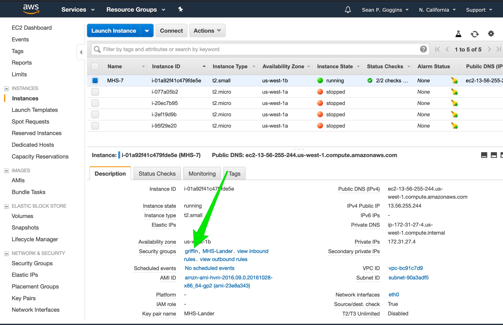
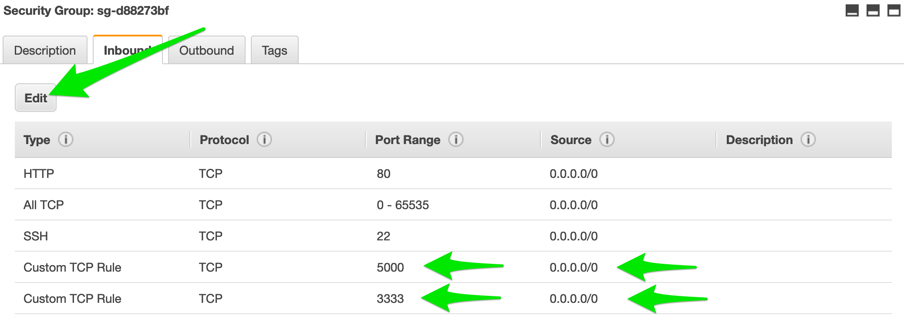

# Making an augur environment on EC2 
1. Check which version of python is default: `which python`
2. Check python version. `python --version` 
3. If needed, install python3 which was not the default. 
4. Also installed virtualenv. 
**This insulates you against the many different configuration issues we are seeing on different ec2 servers.  The command may be `yum` instead of `apt` if you are on the Amazon Linux AMI. **
5. `virtualenv --python=python3 augur` from $HOME
6. `pip install -e .`
7. Check `augur.config.json` For tests I used my `augur.config.json` as a shortcut. 
8. All that seemed to make `make install-dev` work
9. Started augur with `nohup make dev-start &`, which runs it in the background and survives terminal session close
10. You can stop augur then with a regular `make dev-stop`

# From your AWS Console, make sure you open ports 3333 and 5000

# To connect and work with augur: 
1. `source augur/bin/activate`
2. cd augur-se, or whatever your directory for augur is.

# To update augur from github repo: 
1. `git status` to see if you have locally changed files that matter.
2. Often, these files are changed by augur when it starts: 
    -   modified:   frontend/public/app.css
    -   modified:   frontend/public/app.css.map
    -   modified:   frontend/public/app.js
    -   modified:   frontend/public/app.js.map
    -   modified:   frontend/public/vendor.js
    -   modified:   frontend/public/vendor.js.map
3. If those are the only files modified, then you should do a `git stash`. If those are NOT the only files changed: 
    - make sure you have all your group's changes merged into your github repository. 
    - then, on your server, do a `git add --all`, followed by: 
    - `git commit -m "commit message"` and a 
    - `git push`
4. Next, `make dev-stop` to stop your instance if you followed the instructions above. 
5. Then do a `git pull` to get the updates from your github repository. 
6. If you modified any backend files or routes, or just to be safe, its best to do a `make install-dev`, then
7. You can start augur up again using previous notes. `nohup make dev-start &`

# Augur Troubleshooting Notes on EC2

## installing virtualenv

1. `sudo apt install virtualenv`
2. If anyone ever does a `make install-dev` as `sudo make install-dev` then you will have to issue the following command against that directory: 
`sudo chown -R ubuntu (or ec2-user) augur.egg.info`, for example. (ec2-user is the other common username on EC2, depending on which type of EC2 instance you created.) 
    - That `augur.egg.info` file is the most common.  You can tell if this happened by doing an `ls -l` on your directory at the root of augur and see if any of the directories are owned by root. 

## Do you have ghost images of augur running? 

1. First `ps -ef | grep augur`will tell you
2. try `make dev-stop` from $AUGUR_HOME
3. If that does not work, kill the first augur process number in the list from `ps -ef | grep augur` using `kill -9 processid`, like `kill -9 3123`, for example. 

