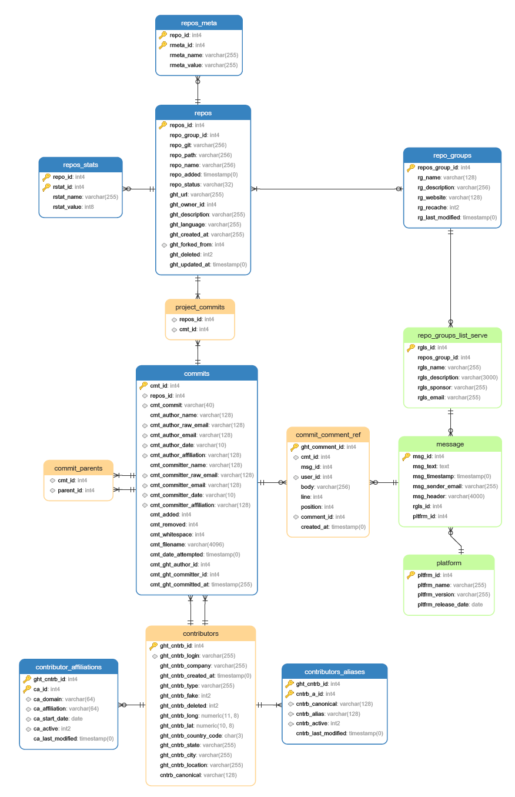

# Sprint 1 Design Document Template

## Deployment Environment

    - Describe how, with relative ease, your TA's and instructors can run  the programs you have built. If they are deployed on a server, don't worry about that, but they might not be. 
    - Instructions on environment parameters we need to set and use. Look at Christian's example in slack. 
    - You may decide not to deploy a database on a server, but please do describe how your system will save data to be loaded on restart. And, if you don't plan to do this, also let us know. 

## Functional Requirements

	1. Use Case Name A
		- Functional Requirement 1
		- Functional Requirement 2
		- ... etc.
	2. Use Case Name B		
		- Functional Requirement 1
		- Functional Requirement 2
		- ... etc.
	3. ... etc. 

## Database Design

### ERD

**some kind of logical ERD, at least, that lets us know what data is being managed**

### DDL 

n/a

## Files that are stubbed out in your repository, with comments about the use cases they are connected to. These sections may not all exist for the Zephyr project teams. Simply explain them as best you can. 

### User Interface Files

1. first one
2. second one
3. etc.

### Model Files (Database Access)

1. first one
2. second one
3. etc

### Controller Files (API or other)

1. first one 
2. second one
3. etc. 

## Describe languages you need to use, and any gaps in skills on your team. 

1. first language 
    - how you will use examples or learn what you need
2. second language 
    - how you will use examples or learn what you need
3. Skill gaps, if any, otherwise specify who is doing what
    - name
    - name
    - skill gap 

